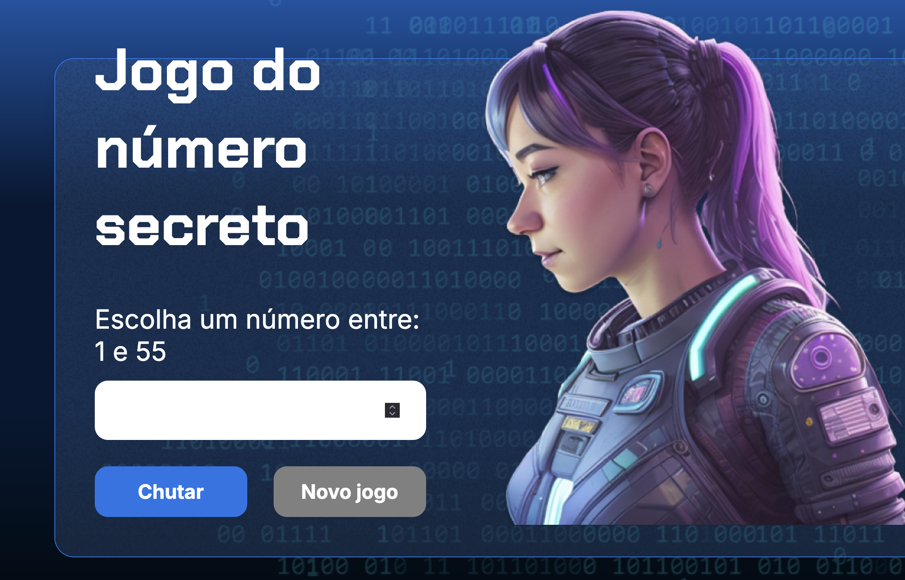

# 🎯 Número Secreto

<div align="center">
  
  
  
  
  
</div>

---

## 📖 Sobre o Projeto

O **Número Secreto** é um projeto criado como parte do curso de **Git e GitHub** da [Alura](https://www.alura.com.br).  
A proposta é simples e eficiente: fixar o aprendizado de versionamento com um pequeno jogo de adivinhação de números em **JavaScript**, utilizando **HTML** e **CSS** para interface.

Este projeto é ideal para quem está começando na programação web e quer reforçar boas práticas de controle de versão.

---

## 🚀 Tecnologias Utilizadas

- ✅ HTML5
- ✅ CSS3
- ✅ JavaScript (ES6+)
- ✅ Git e GitHub

---

## 🎮 Como Rodar o Projeto

1. Clone o repositório:

```bash
git clone https://github.com/jugoliv/numero-secreto.git
```

2. Acesse a pasta:

```bash
cd numero-secreto
```

3. Abra o arquivo `index.html` no navegador da sua escolha.

> 💡 **Dica:** Você pode usar extensões como o Live Server (no VS Code) para facilitar o reload automático.

---

## 💡 Funcionalidades

- 🔢 Geração automática de um número aleatório.
- 👀 Feedback para o usuário: se o chute foi maior ou menor.
- 🏁 Finalização do jogo ao acertar o número.

---

## 🎯 Aprendizados

- Versionamento e controle de código com **Git**.
- Colaboração e fluxo de trabalho no **GitHub**.
- Conceitos básicos de manipulação de DOM com **JavaScript**.
- Estruturação de páginas web com **HTML** e **CSS**.

---

## 🚧 Possíveis Melhorias

- 🎨 Melhorar o design e responsividade.
- 🔄 Implementar a opção de reiniciar o jogo.
- 🔊 Adicionar efeitos sonoros ou visuais.
- 📊 Contabilizar tentativas do usuário.

---

## 🖼️ Demonstração



---

## 🧑‍💻 Autor

Desenvolvido por **[Juba (jugoliv)](https://github.com/jugoliv)**  
Projeto baseado no curso da **[Alura](https://www.alura.com.br)**.

---

## 📄 Licença

Este projeto está sob a licença **MIT**.  
Veja o arquivo [LICENSE](LICENSE) para mais detalhes.

---

## ⭐ Extra

Se você gostou deste projeto, não esqueça de deixar uma ⭐ no repositório!  
Contribuições são sempre bem-vindas. 😄
